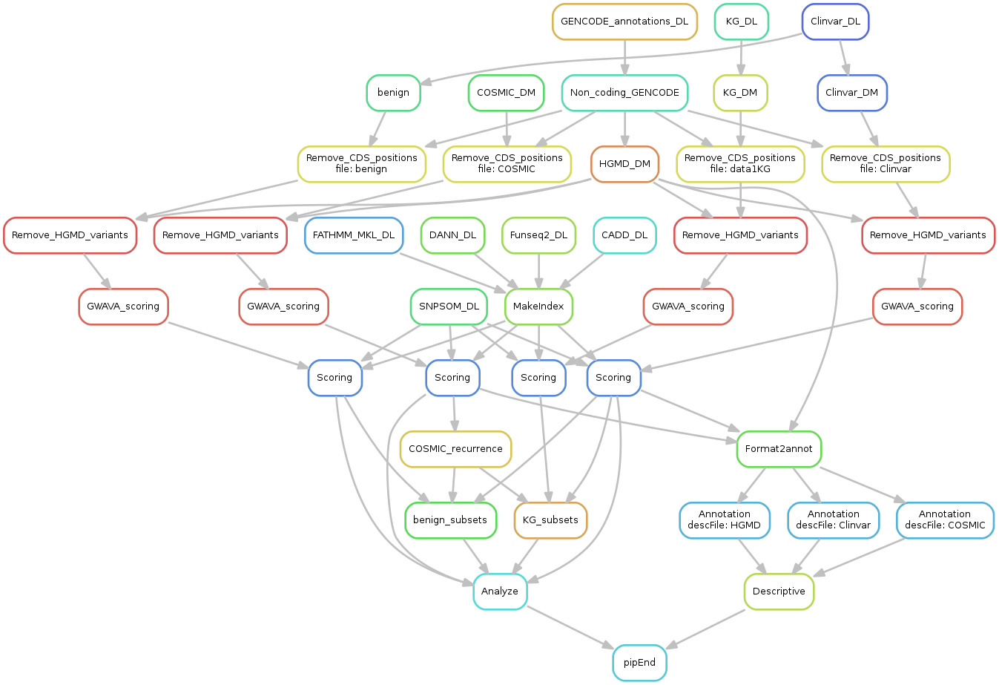

# BenchmarkNCVTools
Pipeline to compare the performance of different tools for the non-coding variant scoring.

## Objectives
Several tools were proposed to prioritize the potential deleterious variants in the non-coding part of the genome. We assessed the performances of the leading scoring systems (CADD, FATHMM-MKL, Funseq2 and GWAVA) and some recent competitors (DANN, SNP and SOM scores) in term of sensibility, specificity and precision. This pipeline allows to reproduce the results of this study (tables and figures).


## Prerequisites
### Softwares
This pipeline was tested on Debian 8 (Jessie) 64 bits, version 3.16. It requires some classical bioinformatic softwares (Bedtools and Tabix). C++ codes were developped for special data modifications and to solve some memory issues or bottlenecks that Bedtools could encounter. Python is required especially for snakemake and GWAVA scoring. R is required to analyze the data.
The following software versions were used during the study:
* Bedtools (2.21.0)
* Tabix (0.2.5)
* g++ (4.9.2)
* python (2.7)
 * numpy (1.12.0)
 * scipy (0.15.1)
 * pandas (0.19.2)
 * scikit-learn (0.14.1)
 * pybedtools (0.6.9)
 * tabix (1.0)
* snakemake (3.7.0)
* R (3.3.2)
 * PRROC (1.1)

<aside class="warning">
**Warning:** Pybedtool python package should be 6.9 or lower to use GWAVA scoring software. Due to the recent modification of metrics and model selection commands of the scikit-learn package, it is recommanded that use an old version to use GWAVA scoring software.
</aside>

### Hardware specific requirements
Some rule may use until 3Go of RAM. A minimum of 6Go of RAM is recommended to run the pipeline using a single thread. Be sure to have a sufficient amount of RAM if you choose to use the snakemake *cores* option to parallelize.

Computational speed was increase at the expense of the physical hard disk space. Free hard disk space of 1.5 To is the minimal configuration.

### Data
<aside class="warning">
**Important: ** The COSMIC and HGMD dataset are not provided in accordance with the COSMIC and HGMD license agreement. You have to subcribe to COSMIC license (free of charge for academic and non-profit organisations) to get the COSMIC data at http://cancer.sanger.ac.uk/cosmic/download (more information on COSMIC license: http://cancer.sanger.ac.uk/cosmic/license). Similarly, licence and registering information for the HGMD dataset may be found at http://www.hgmd.cf.ac.uk/docs/register.html.
</aside>


## Use
### Installation
Get the entire content of this repo on your disk. Open a console in the directory of the pipeline and run the setup.sh:
```bash
source setup.sh
```
Then, run the snakefile (see below) which will automatically create the required folder and compile the C++ code.

### Running
First open a console in the directory of the pipeline.
The complete pipeline may be printed using:
```bash
snakemake report.txt --dag | dot | display
```

Simply run the following command to run the pipeline:
```bash
snakemake --cores=2 report.txt
```
You can modify the number of used cores as you wish. Be careful to have enough memory (see **Hardware specific requirements** section).

**Note:** You will have to wait several days due to some unavoidable bottleneck (e.g. GWAVA scoring).


## Description of the pipeline
This section describes the main steps of the pipeline.
### First step: Deployment
The pipeline creates the required sub-directories and compiles the codes.
### Second step: Get the data (except COSMIC, see Prerequisites section)
The source files of the scores and the variants are downloaded. This can take several hours for the larger files.
### Third step: Filter the data
This step removes the coding positions, according GENCODE annotation, from the variants databases. It removes also the HGMD variants to avoid overfitting bias of tools trained with this dataset.
### Fourth step: Score
This step attributes the scores to the variants. This could take few hours, excepting for GWAVA scoring which is the main bottlenake of this pipeline (could take several days).
### Fifth step: Analyze
Descriptive statistics (feature distribution in the different dataset), ROC and PR curve are computed. Tables and figures are providing in the *Results* folder.

## Remarks
* Precomputed scores were used, excepting for GWAVA because the genome coverage of the provided dataset is limited. That is why the GWAVA software was used, despite the long duration of the computation.

